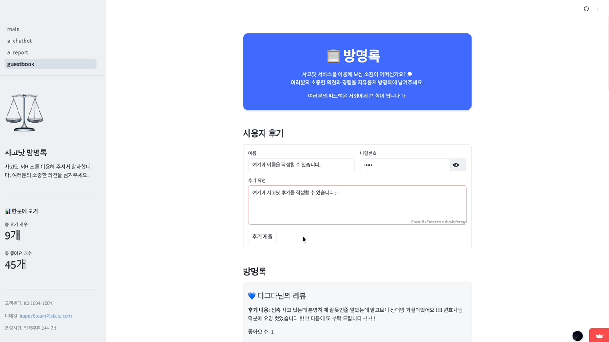

# lawChatBot


## 프로젝트 소개 
- 이거는 마지막에 채울 예정 
```
사진 넣을 거임
```

## 프로젝트 배경

- **개발 기간** : 2025.03.15 ~ 2025.04.15
- **진행 배경 및 목적** :
    
    본 프로젝트는 **SK C&C**가 주관하는 **SKALA 1기 교육 과정**의 일환으로, 팀 단위 실습을 통해 기획 및 개발을 진행한 결과물입니다.   
    SKALA 교육 기간 중 수행한 팀 프로젝트를 보다 발전시키기 위해, 짧은 시간 내에 **핵심 기능 구현에 집중하는 프로젝트**입니다.
    
- **주요 목표**
    - LLM(대규모 언어 모델)을 활용한 **지능형 서비스 구현**
    - API 서버와 Streamlit 기반 프론트엔드 간의 연동
    - 데이터베이스를 활용한 **방명록 기능 구현**

<br/>

## System Architecture


<br/>

## 팀원 구성
<div align="center">

| **김다은** | **김민주** | **손지영** | **이재웅** | **이효정** | **진실** |
| :--------: | :--------: | :--------: | :--------: | :--------: | :------: |
|  |  |  |  |  |  |
| [@ilikewhale](https://github.com/ilikewhale) | [@alswnsp411](https://github.com/alswnsp411) | [@zi0-hand](https://github.com/zi0-hand) | [@ww5702](https://github.com/ww5702) | [@world-dv](https://github.com/world-dv) | [@zinsile](https://github.com/zinsile) |
| 방명록 | AI 법률 보고서 | AI 법률 보고서 | 실시간 AI 법률 상담 | 방명록 | 실시간 AI 법률 상담 |

</div>


<br/>

## 기술스택
### Language & Frameworks
- Python 3.12
- OpenAI API
- LangChain 0.1.16
- Streamlit 1.43.2
- ChromaDB >= 0.5.2
- Tavily API >= 0.3.0
### Backend Architecture
- SQLite3
- LangChain 기반 RAG (Retrieval-Augmented Generation)
- LangChain Agent 구조
- Streamlit SessionState 활용
### 웹 크롤링 및 문서 전처리
- BeautifulSoup4 == 4.13.3
- DuckDB == 1.2.2
### 배포 환경
- Streamlit Cloud
### 협업 및 버전 관리
- GitHub


<br/>

## 주요 기능 


<p align="center">
  
</p>


### 실시간 AI 법률 상담
<p align="center">
  
</p>


- **대화형 AI 상담**: 사용자의 법률 질문에 대해 실시간으로 답변합니다.
- **법률 정보 검색**: 관련 법률 조항과 판례를 검색하여 정확한 정보를 제공합니다.
- **사례 분석**: 유사한 법률 사례와 예상 결과를 제공합니다.

<br/>

### AI 법률 보고서 + 변호사 매칭 
<p align="center">
  
</p>

- **사건 정보 수집**: 사용자가 선택한 법률 카테고리에 따라 단계별 질문을 제공하고, 사건 정보를 구체화합니다.
- **추가 질문 생성**: LLM이 사건 해결에 필요한 추가 정보를 판단하고 자동으로 후속 질문을 생성합니다.
- **법률 보고서 생성**: 수집된 정보를 기반으로 AI가 법률 보고서를 생성하고, 텍스트 파일로 제공합니다.
- **변호사 매칭**: 프론트엔드 상의 등록된 변호사 목록에서 사용자가 직접 선택하여 매칭할 수 있는 인터페이스를 제공합니다.

<br/>

### 방명록
<p align="center">
  
  
</p>

- **방명록 작성**: 사용자가 자유롭게 메시지를 남길 수 있는 방명록 작성 기능을 제공합니다.
- **방명록 좋아요**: 사용자가 게시된 방명록 글에 ‘좋아요’를 눌러 공감과 응원의 뜻을 표현할 수 있습니다.
- **방명록 수정/삭제**: 비밀번호 인증을 통해 사용자가 본인의 방명록 글을 수정하거나 삭제할 수 있습니다.


<br/>

### 서비스 통계
  - **누적 상담 건수**: 사용자의 누적 상담 건수를 제공합니다.
  - **누적 보고서 생성 수**: 사용자가 생성한 누적 보고서 수를 제공합니다.
  - **총 누적 사용 수**: 서비스 누적 사용자 수를 제공합니다.


<br/>

## Getting Started

### Installation

```
npm install streamlit
npm install sqlite3
npm install
```

### Run

```
streamlit run main.py
```
